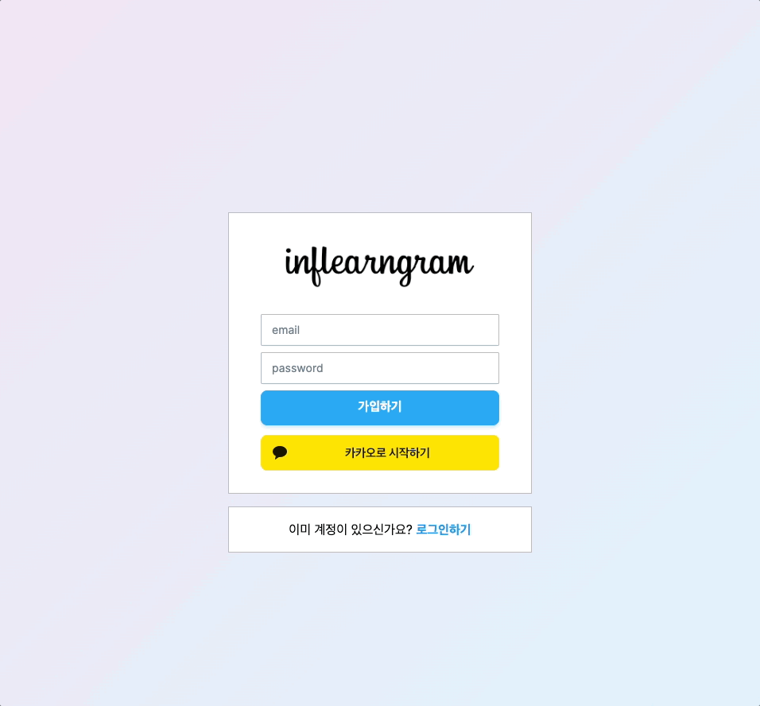
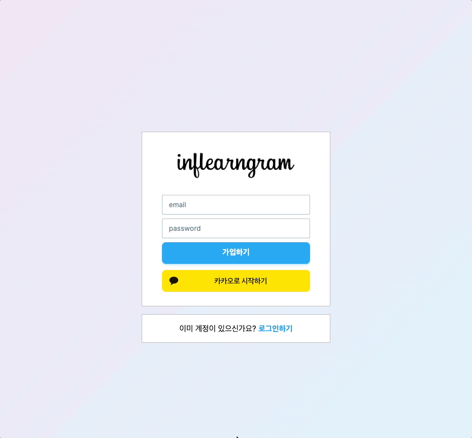
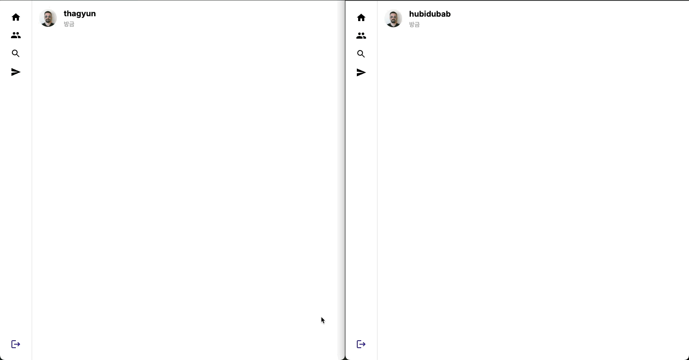
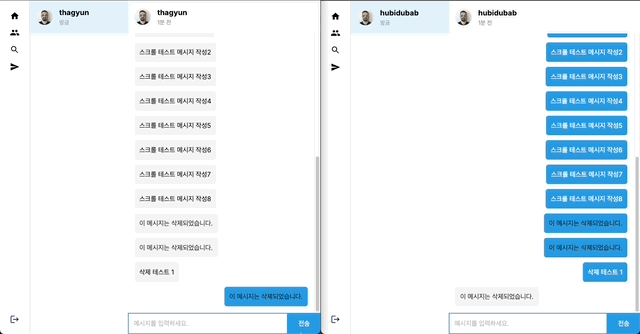

## Instagram Clone

Next.js(Server Action, React Query, Material Tailwind, Recoil) + Supabase(Authentication, RLS, Realtime)

인프런 워밍업 스터디 3기 풀스택 4주차 미션4 입니다.  
[강의: [풀스택 완성]Supabase로 웹사이트 3개 클론하기(Next.js 14)](https://www.inflearn.com/course/%EC%9A%94%EC%A6%98%EC%97%94-supabase-%EB%8C%80%EC%84%B8%EC%A7%80-nextjs-%ED%81%B4%EB%A1%A0%ED%94%84%EB%A1%9C%EC%A0%9D%ED%8A%B8/dashboard)

### 회원가입



### Kakao 로그인



### 메시지 전송, 메시지 삭제, 메시지 읽음, 타이핑 상태 실시간 추적



### 로그아웃



## 미션:

**이제까지 만드신 모든 프로젝트를 배포하신 후 배포된 링크를 업로드 해주세요.**

**(선택사항)
Instagram Clone 프로젝트에 아래 기능 중 하나를 선택하여 구현하세요.
아래 예시 외에도 "채팅 신고", "유저 차단기능" 등 다른 기능을 추가 구현하셔도 괜찮습니다.**

1️⃣ 채팅 메시지 삭제 기능

- 사용자가 특정 채팅 메시지를 삭제할 수 있도록 구현
- (선택 사항) 삭제된 메시지 대신 “이 메시지는 삭제되었습니다” 같은 알림 표시\*\*

2️⃣ 채팅 읽음/안 읽음 표시 기능

- 채팅방에서 사용자가 읽지 않은 메시지 개수를 표시
- 상대방이 메시지를 읽었는지 확인할 수 있는 “읽음” 표시 추가

---

**Instagram Clone 프로젝트 구현 사항:**

- 사용자가 특정 채팅 메시지를 삭제할 수 있도록 구현
- 상대방이 메시지를 읽었는지 확인할 수 있는 “읽음” 표시 추가
  - “읽음” 표시 대신 “1” 표시
- 상대방이 메시지 작성 중인지 타이핑 표시 추가
- 메시지 창 진입시 마지막 채팅으로 스크롤 이동

**모든 프로젝트 배포:**

**Todo-list** : [TODO LIST](https://todo-list.tikittaka.site/)

**dropbox clone** : [Dropbox clone](https://minibox-clone.tikittaka.site/)

**netflix clone** : [TMDBFLIX](https://tmdbflix-clone.tikittaka.site/)

**instagram clone** : [Inflearngram clone](https://inflearngram-clone.tikittaka.site/)

## 과제 해결 과정

### 배포

**Vercel**을 이용해 GitHub과 연동하여 간편하게 배포할 수 있었다.  
가비아에서 도메인 구매부터 설정을 완료하는 데까지 10분도 걸리지 않았다.

또한, `.env` 파일에 도메인 환경 변수를 추가하고 로그인 콜백 URL을 수정한 뒤 재배포하니,  
정상적으로 로그인까지 이루어지는 것을 확인할 수 있었다.

**SMTP 설정**  
도메인을 구매하여 SMTP 설정도 해주었다.  
가비아 도메인 설정에서 Resend의 DNS 레코드를 추가하면 간단하게 설정이 완료된다.  
Supabase Authentication>Emails>SMTP Settings에서 활성화한 후 SMTP를 설정해준다.

**openGraph 설정**  
openGraph 메타태그를 설정할 때, 이미지 경로를 상대경로로 입력했더니 메타태그 자체는 정상적으로 적용되었지만, 이미지는 제대로 불러오지 못했다.

검색해보니 Open Graph의 `og:image` 속성에는 **절대경로**를 사용해야 한다는 점을 알게 되었다. 상대경로(`/images/image.jpg`)를 사용하면 Facebook, Twitter, Kakao 등의 플랫폼에서 이미지를 정상적으로 불러오지 못할 수 있기 때문이다.  
따라서, 이미지 경로를 절대경로로 변경해줬다.

```tsx
export const metadata: Metadata = {
  title: "Instagram clone",
  description: "nextjs supabase Instagram clone",
  openGraph: {
    images: [
      {
        url: "https://inflearn-nextjs-supabase-instagram-clone.vercel.app/images/inflearngram.png",
        alt: "inflearngram",
      },
    ],
  },
};
```

## 기능 구현

### getAllMessages 400 에러 해결과정

RLS를 적용한 후, Chat 페이지에 처음 접근할 때 `ChatPeopleList`와 `ChatScreen` 두 개의 컴포넌트가 동시에 렌더링되었다.  
이 과정에서 `ChatScreen`의 `getAllMessages` 함수가 호출되었는데, 해당 함수는 선택된 유저의 아이디를 매개변수로 받아야 한다.

문제는 페이지에 처음 진입했을 때는 아직 유저가 선택되지 않은 상태이므로, `getAllMessages(null)`이 호출되면서 400 에러가 발생했다.

이를 해결하기 위해, `getAllMessages` 함수에서 매개변수가 `null`인 경우 빈 배열을 반환하도록 수정했다. 이를 통해 초기 렌더링 시 발생하던 에러를 해결했다.

### 사용자가 특정 채팅 메시지를 삭제할 수 있도록 구현

데이터베이스에서 메시지를 완전히 삭제하는 대신,
`is_deleted` 컬럼을 사용하여 논리적으로 삭제하는 방식으로 처리하도록 구현했다. 논리적 삭제(Update) 후 데이터를 다시 불러와 ‘이 메시지는 삭제되었습니다.’로 표시했다.

**`componenets/chat/ChatScreen.tsx`**

**[Supabase에서 is_deleted 값 업데이트]**

```tsx
export async function deletedMessage(id) {
  const supabase = createBrowserSupabaseClient();
  const { error } = await supabase
    .from("message")
    .update({ is_deleted: true })
    .eq("id", id);

  if (error) {
    throw new Error(error.message);
  }
}
```

메시지의 `id`를 받아 해당 메시지의 `is_deleted` 값을 `true`로 업데이트한다.

**[Supabase Realtime 업데이트 감지]**

```tsx
useEffect(() => {
  const channel = supabase
    .channel("message_postgres_changes")
    .on(
      "postgres_changes",
      { event: "UPDATE", schema: "public", table: "message" },
      (payload) => {
        if (payload.eventType === "UPDATE" && !payload.errors) {
          getAllMessagesQuery.refetch();
        }
      }
    )
    .subscribe();

  return () => {
    channel.unsubscribe();
  };
}, []);
```

UPDATE 이벤트가 발생하면 `getAllMessagesQuery.refetch()`로 변경된 메시지를 반영한다.

**[삭제 버튼 Mutation]**

```tsx
const deletedMessageMutation = useMutation({
  mutationFn: deletedMessage,
});
```

삭제 버튼을 클릭했을 때 해당 메시지를 삭제하는 `Mutation`을 호출한다.

**[메시지 컴포넌트 렌더링]**

```tsx
{
  getAllMessagesQuery.data?.map((message) => (
    <Message
      key={message.id}
      isFromMe={message.receiver === selectedUserID}
      isDeleted={message.is_deleted}
      isReadAt={message.read_at}
      onClickDeleted={() => deletedMessageMutation.mutate(message.id)}
      message={
        message.is_deleted ? "이 메시지는 삭제되었습니다." : message.message
      }
    />
  ));
}
```

삭제 버튼 클릭 시, `onClickDeleted` 핸들러가 호출되며 `deletedMessageMutation.mutate(message.id)`를 통해 삭제를 수행한다.

**`componenets/chat/Message.tsx`**

```tsx
export default function Messag({
  onClickDeleted,
  isDeleted,
  isReadAt,
  isFromMe,
  message,
}) {
  const [showButton, setShowButton] = useState(false);

  return (
    <div
      onMouseEnter={() => setShowButton(true)}
      onMouseLeave={() => setShowButton(false)}
      onClick={() => setShowButton(true)}
    >
      <div>
        {isReadAt == null && isFromMe && <p>{"1"}</p>}
        {!isDeleted && isFromMe && showButton && (
          <button onClick={onClickDeleted}>
            <i className="fa fa-times"></i>
          </button>
        )}
        <div>
          <p className={`${isDeleted ? "text-gray-900" : ""}`}>{message}</p>
        </div>
      </div>
    </div>
  );
}
```

`Message` 컴포넌트에서는 `isDeleted`, `onClickDeleted`, `message` 등의 props를 받는다.  
각 메시지를 렌더링할 때, `is_deleted` 값에 따라 메시지를 다르게 표시한다. 만약 메시지가 삭제된 상태라면 "이 메시지는 삭제되었습니다."라고 표시하고, 내가 보낸 메시지 중 삭제되지 않은 메시지에는 삭제 버튼을 표시하여 삭제 기능을 수행할 수 있다.

### 상대방이 메시지를 읽었는지 확인할 수 있는 “읽음” 표시 추가

(“읽음” 표시 대신 “1” 표시)


`ChatPeopleList` 컴포넌트에서 온라인 상태를 추적하는 `Channel`을 설정하고, `ChatScreen` 컴포넌트에서 유저의 입장과 퇴장을 추적하는 `Channel`을 설정했다.

`Message` 테이블에 `read_at` 컬럼을 추가하여, 각 메시지가 읽혔는지 여부를 관리하도록 한다.  
채팅 화면에서 유저가 입장할 때(즉, 상대방이 채팅방에 들어올 때), `Presence` 채널의 `join` 이벤트를 활용하여 해당 유저의 메시지 중 아직 읽지 않은 메시지(`read_at`이 `null`인 메시지)를 현재 시각으로 업데이트한다. 상대방이 메시지를 읽었을 때, 메시지의 상태가 업데이트된다.

**`componenets/chat/ChatScreen.tsx`**

**[Presence 채널과 Join 이벤트 처리]**

```tsx
useEffect(() => {
  const presenceKey = `${loggedInUser.email?.split("@")?.[0]}-${
    selectedUserQuery.data?.email?.split("@")?.[0]
  }`;

  const channel = supabase.channel("message_postgres_changes", {
    config: {
      presence: {
        key: presenceKey,
      },
    },
  });

  channel
    .on("presence", { event: "join" }, ({ key, newPresences }) => {
      const newState = newPresences;
      Object.keys(newState).forEach((key) => {
        if (key === presenceKey) return;

        if (!isJoined) {
          setIsJoined(true);
          readMessageMutation.mutate();
        }
      });
    })
    .on("presence", { event: "leave" }, ({ key }) => {
      if (key === presenceKey) return;

      setIsJoined(false);
    })
    .subscribe();

  return () => {
    channel.unsubscribe();
  };
}, []);
```

`join` 이벤트가 발생하면 `readMessageMutation.mutate()`를 호출하여 해당 메시지를 읽은 시점으로 업데이트한다.

**[읽음 시각 업데이트 Mutation]**

```tsx
const readMessageMutation = useMutation({
  mutationFn: () => readMessage({ chatUserId: selectedUserID }),
});
```

readMessageMutation은 `readMessage`를 호출한다.

**[Supabase에서 read_at 값 업데이트]**

```tsx
export async function readMessage({ chatUserId }) {
  if (chatUserId === null) return;

  const supabase = createBrowserSupabaseClient();

  const {
    data: { session },
    error,
  } = await supabase.auth.getSession();

  if (error || !session.user) {
    throw new Error("User is not authenticated");
  }

  const { error: readMessagesError } = await supabase
    .from("message")
    .update({ read_at: new Date().toISOString() })
    .eq("receiver", session.user.id)
    .eq("sender", chatUserId)
    .is("read_at", null);

  if (readMessagesError) {
    throw new Error(readMessagesError.message);
  }
}
```

readMessage는 읽지 않은 메시지(read_at이 null인 메시지)를 현재 시간으로 업데이트한다.  
`receiver`: 로그인된 사용자와 `sender`: 채팅 상대방이 일치하고, `read_at`이 `null`인 메시지에 대해 현재 시각을 `read_at`에 업데이트한다.

**[읽음 표시 추가 → “1” 읽지 않음으로 표시]**

```tsx
{
  getAllMessagesQuery.data?.map((message) => (
    <Message
      key={message.id}
      isFromMe={message.receiver === selectedUserID}
      isDeleted={message.is_deleted}
      isReadAt={message.read_at}
      onClickDeleted={() => deletedMessageMutation.mutate(message.id)}
      message={
        message.is_deleted ? "이 메시지는 삭제되었습니다." : message.message
      }
    />
  ));
}
```

`isReadAt` 값을 `Message` 컴포넌트에 전달한다.

**`componenets/chat/Message.tsx`**

```tsx
export default function Messag({
  onClickDeleted,
  isDeleted,
  isReadAt,
  isFromMe,
  message,
}) {
  const [showButton, setShowButton] = useState(false);

  return (
    <div
      onMouseEnter={() => setShowButton(true)}
      onMouseLeave={() => setShowButton(false)}
      onClick={() => setShowButton(true)}
    >
      <div>
        {isReadAt == null && isFromMe && <p>{"1"}</p>}
        {!isDeleted && isFromMe && showButton && (
          <button onClick={onClickDeleted}>
            <i className="fa fa-times"></i>
          </button>
        )}
        <div>
          <p className={`${isDeleted ? "text-gray-900" : ""}`}>{message}</p>
        </div>
      </div>
    </div>
  );
}
```

`Message` 컴포넌트에서 `isReadAt` 값이 `null`인 경우, 즉 상대방이 메시지를 읽지 않았다면 `"1"`을 표시하여 읽지 않음을 나타낸다.

### 상대방이 메시지 작성 중인지 타이핑 표시 추가

이 기능은 Precence 자료를 찾다가 한 영상을 발견하면서 프로젝트에 넣어봤다.

[Chat app with Nextjs & Supabase | Postgres Changes | Presence | Supbase Realtime Course part 1](https://youtu.be/sE7KifauAog?si=ysuOc3GTAuSKFcEH)

**[Realtime Subscription 설정]**

```tsx
const [typingUsers, setTypingUsers] = useState([]);
const channelRef = useRef(null);

const realTimeSubscription = () => {
  const presenceKey = `${loggedInUser.email?.split("@")?.[0]}-${
    selectedUserQuery.data?.email?.split("@")?.[0]
  }`;

  const channel = supabase.channel("message_postgres_changes", {
    config: {
      presence: {
        key: presenceKey,
      },
    },
  });

  channel
    .on(
      "postgres_changes",
      { event: "INSERT", schema: "public", table: "message" },
      (payload) => {
        // ...
      }
    )
    .on(
      "postgres_changes",
      { event: "UPDATE", schema: "public", table: "message" },
      (payload) => {
        // ...
      }
    )
    .on("presence", { event: "sync" }, () => {
      const newState = channel.presenceState();

      let filteredUsers = [];
      // 타이핑 중인 유저 추적
      Object.keys(newState).forEach((key) => {
        if (key === presenceKey) return;

        const presences = newState[key];

        presences.forEach(
          (presence: {
            presence_ref: string;
            isTyping?: boolean;
            name?: string;
          }) => {
            if (presence.isTyping) {
              filteredUsers.push(presence.name); // 타이핑 중인 유저 이름 추적
            }
          }
        );
      });

      setTypingUsers(filteredUsers); // 타이핑 중인 유저 상태 업데이트
    })
    .subscribe(async (status) => {
      if (status !== "SUBSCRIBED") return;

      // 타이핑 상태를 false로 초기화
      await channel.track({
        onlineAt: new Date().toISOString(),
        isTyping: false,
        name: loggedInUser.email?.split("@")?.[0],
      });
    });

  return channel;
};
```

Presence를 통해 사용자의 타이핑 상태를 실시간으로 추적하고 동기화한다.  
타이핑 상태인 사용자들을 추적하여 `filteredUsers` 배열에 추가하고, `setTypingUsers`를 통해 관리한다.

```tsx
useEffect(() => {
  if (!selectedUserID) return;

  channelRef.current = realTimeSubscription();

  return () => {
    channelRef.current?.unsubscribe();
  };
}, [selectedUserQuery?.data]);
```

useEffect내에서 `realTimeSubscription`을 호출하고, `channelRef`로 채널을 관리하여 구독을 설정한다.

**[타이핑 상태 트래킹]**

```tsx
const isTypingRef = useRef(false); // 타이핑 상태 추적
const typingTimeoutRef = useRef(null); // 타이핑 후 시간 지연 처리

const trackTyping = async (status) => {
  await channelRef.current.track({
    isTyping: status,
    name: loggedInUser.email?.split("@")?.[0],
  });
};

const handleInputChange = async (e) => {
  setMessage(e.target.value);

  // 타이핑이 시작되면 isTyping 상태를 true로 설정
  if (!isTypingRef.current) {
    await trackTyping(true);
    isTypingRef.current = true;
  }

  // 기존 타이머가 있으면 clear
  if (typingTimeoutRef.current) clearTimeout(typingTimeoutRef.current);

  // 2초 뒤 타이핑 종료
  typingTimeoutRef.current = setTimeout(async () => {
    if (!isTypingRef.current) return;
    await trackTyping(false);

    isTypingRef.current = false;
  }, 2000);
};
```

`trackTyping` 함수는 유저가 타이핑 중인지 여부를 `channel.track()`로 실시간으로 업데이트한다.

`handleInputChange` 함수는 사용자의 타이핑 상태와 타이핑 종료 타이머를 관리한다.
사용자가 메시지를 입력하기 시작하면 `isTyping` 상태를 `true`로 설정하고, 타이핑을 멈추면 2초 후에 `isTyping`을 `false`로 설정하여 타이핑 상태 변화를 반영한다.

**[타이핑 상태 표시]**

```tsx
  {/* 채팅방 영역 */}
  <div className="flex flex-col">
    {typingUsers.length > 0 && (
      <div className="w-full flex items-center space-x-2 text-gray-500">
        <span className="text-sm">{typingUsers[0]} is typing...</span>
      </div>
    )}
    <div className="flex">
      <input
        value={message}
        onChange={handleInputChange}
        onKeyDown={(e) => {
          if (e.key === "Enter" && !e.nativeEvent.isComposing) {
            e.preventDefault();
            sendMessageMutation.mutate();
          }
        }}
        className="p-3 w-full border-2 border-light-blue-600"
        placeholder="메시지를 입력하세요."
      />
```

`typingUsers`를 통해 타이핑 중인 사용자들의 이름을 업데이트하고, 화면에서 타이핑 상태를 "is typing..." 형태로 표시한다.

(etc. 한글 메시지 엔터 이벤트 시 2번 보내지는 오류는 e.nativeEvent.isComposing을 통해 해결했다.
문자 입력중인 상태를 감지하여 입력이 완료된 상태(false)만 전송이 가능하다.)

### 메시지 창 진입시 최신 채팅으로 스크롤 이동

```tsx
export default function ChatScreen({ loggedInUser }) {
  const chatRef = useRef<HTMLDivElement>(null);
  const [scrollOn, setScrollOn] = useState(true);

  useEffect(() => {
    if (!chatRef.current || !getAllMessagesQuery.isSuccess) return;

    if (scrollOn) {
      chatRef.current.scrollTop = chatRef.current.scrollHeight;
    }
  }, [
    selectedUserID,
    getAllMessagesQuery.isSuccess,
    getAllMessagesQuery.data,
    scrollOn,
  ]);

  return selectedUserQuery.data !== null ? (
   // ...
      {/* 채팅 영역 */}
      <div ref={chatRef}>
        // ...
      </div>
    // ...
   ) : (
    <div></div>
  );
}
```

채팅방에 들어왔을때와 새 메시지가 오면 useRef를 사용하여 최신 메시지로 스크롤을 이동한다.  
메시지 삭제(Update)시 데이터가 다시 불러와지는데, scrollOn으로 삭제시에는 스크롤이 유지되도록 설정했다.  
따라서 채팅방에서 최신 메시지를 자동으로 보여주고, 메시지 삭제 시에는 스크롤을 유지한다.
